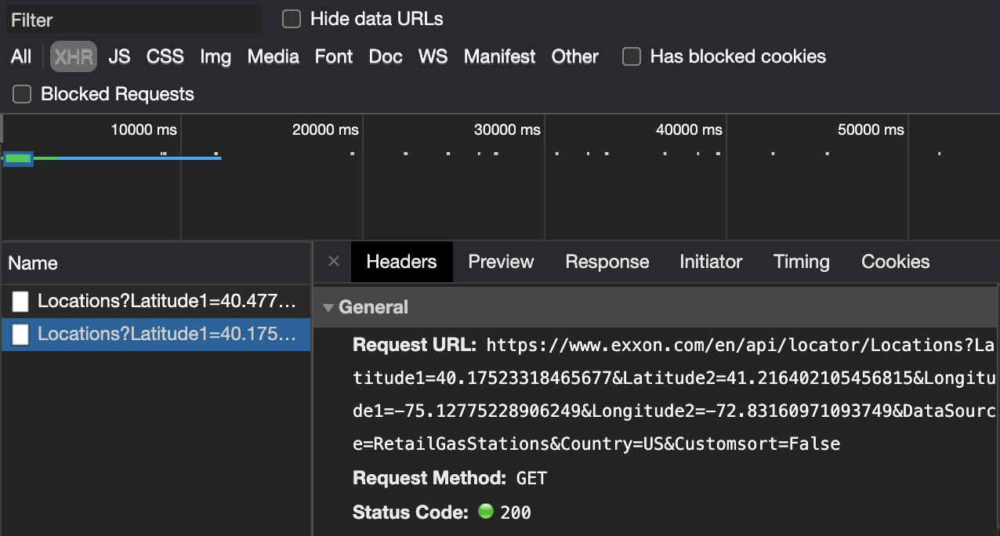

# Exxon Crawler

### Approach 1
index.js is an example of how to crawl https://www.exxon.com/en/find-station for (address and latitude/longitude) data for the New York City location using node.js and Puppeteer.

### Approach 2
An alternative and more efficient approach is to find the server's internal API that fetches the data directly. shortcut.js attempts to fetch the same exact data without headless browsing. The way to find an internal API is through chrome's network tab and filtering under XHR.

 
